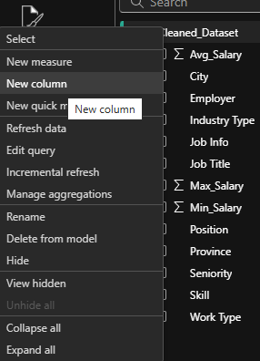
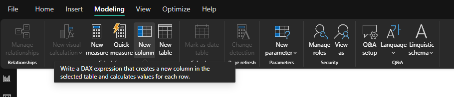
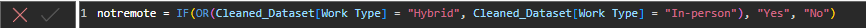
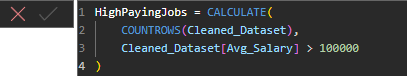
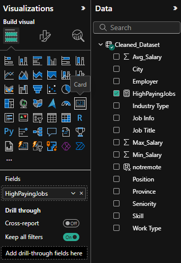
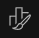

### **Creating Dax measures/columns**

**DAX (Data Analysis Expressions)** is the formula language in Power BI. You can use it to create calculated fields that aren’t in your dataset.

#### Calculated Columns  

These are added to your data table  

For example, we can make an in-person indicator column. If the job requires you to be in-person at any point, “Yes” and if not, “No.”

To do this, you can either right-click on your dataset and choose ‘new column’ or go to Modeling → New Column. 


 

Then, in the textbox that opens up, replace ‘column’ with the name you want your column to be and enter the code. For this example, it would be: 

```dax
notremote = IF(OR(Cleaned_Dataset[Work Type] = "Hybrid", Cleaned_Dataset[Work Type] = "In-person"), "Yes", "No").  
```

Click the check-mark and you should now have a new label under your dataset in the right data panel.   
 


#### DAX Measures 

Similarly, you can also create DAX measures. These are values that are fields for your dataset. These are not stored in the table, they calculate values on the fly.

For example, say you want to see the jobs that pay above $100k. 

To do this, you can either right-click on your dataset and choose ‘new measure’ or go to Modeling → New Measure. 

Then, in the textbox that opens up, replace ‘Measure’ with the name you want your measure to be and enter the code. For this example, it would be: 

```dax
HighPayingJobs = CALCULATE(
    COUNTROWS(Cleaned_Dataset),
    Cleaned_Dataset[Avg_Salary] > 100000
)
```



#### Card Visual

To see this value, we can create a visual. Let’s make a card. Cards are tools for presenting key metrics in a visually appealing format. 

**Step 1:** In the visualization panel, select the card icon  
**Step 2:** In the values field, drag and drop the HighPayingJobs measure

  
Now on your canvas, you will be able to see the card. You can format this card in a number of ways in the ‘Format your visual’ tab in the visualizations panel (). 