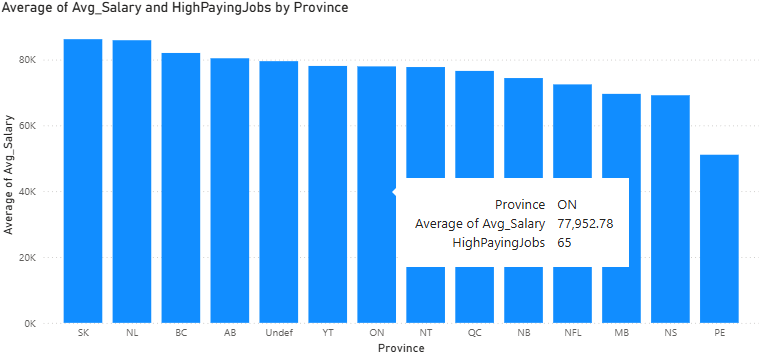
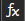
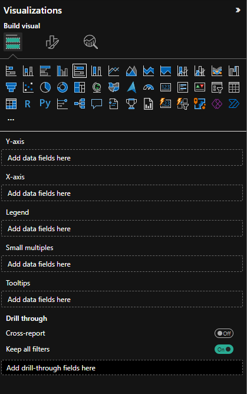
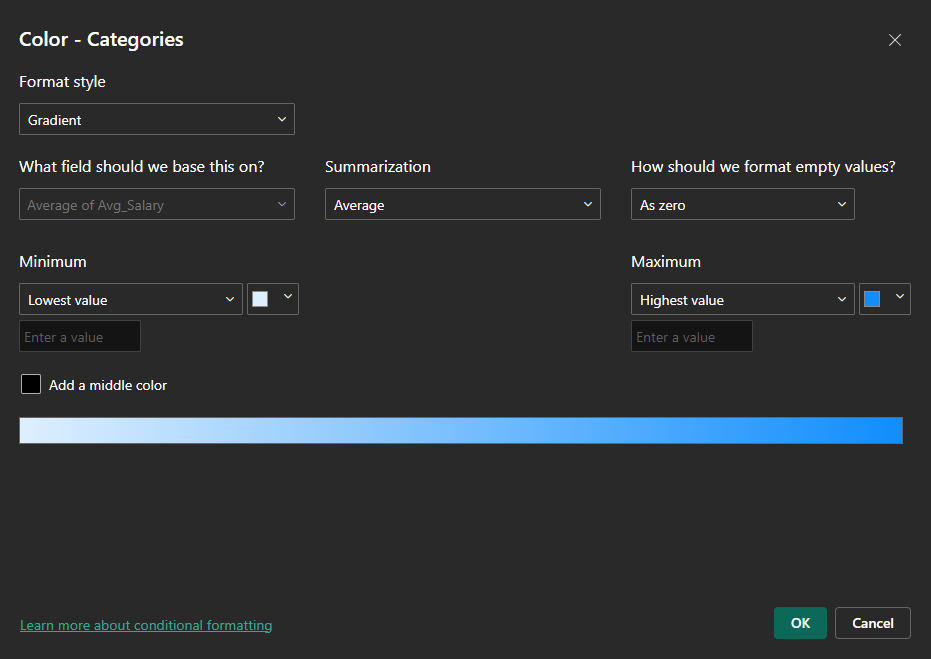
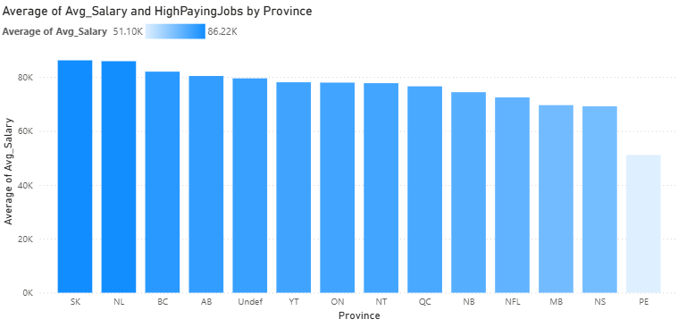
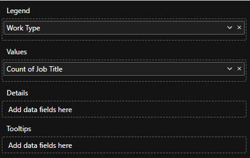
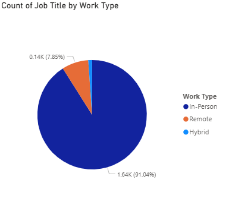
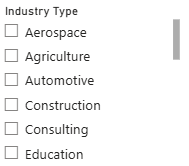

### **Creating simple visuals**

Creating visuals in Power BI is pretty straightforward. 

1. You start by selecting the visual form the visualisation panel (e.g. stacked bar chart, line chart, etc.)   
2. Next, fill out the required fields.   
   1. Drag fields from your dataset (in Data Panel) and drag them into the fields sections (eg. x-axis, y-axis, tooltips, etc.)  
   2. Different visuals require different fields:  
      1. bar/column charts → need an axis  
      2. Card visuals → need only single numeric field  
3. Tooltips  
   1. Many visuals include a Tooltips section  
   2. Fields placed here will appear when you hover your mouse over parts of the visual, giving extra context without cluttering the main chart.

Let’s make a few visuals for this dashboard. 

#### Bar Chart:

Select Clustered Column Chart from the list of visuals. Then, in the axis, let’s drag in the province and for the y-axis, avg\_salary. For this, make sure to have the y-axis be average of avg\_salary. For tooltips, we can have our newly created measure of HighPayingJobs. You should see a chart like this: 

  
When you hover over a bar, you can see the tooltip we added as well as other relevant information. This can be customized further to your liking like adjusting the titles/axis titles,changing the colour of the bars and more. Let’s try changing the bar colours:   
Head to the format your visual tab and select columns. Now, if you want each bar to be a separate colour, choose the different values in categories and select different colours. Another way to colour the bars is to have categories set to all and clicking the conditional formatting option (). There are various options here. For example, we can set format style to gradient and this can be based on the average salary. Now, selecting ‘OK’, we can see that the bars are coloured such that higher average salary provinces are darker.    
 

#### Pie Chart

Let’s make one more. How about a pie chart this time. We can see the proportion of different work types in this list of jobs. 

Select Pie Chart from the list of visuals. For the legend, we want it to be coloured so that the different work types are shown. So, drag and drop ‘Work Type’ for Legend. For the values, we want all the different jobs available. So, we can drag and drop Job Title and set it to ‘count’. This counts the number of job titles that are there in the dataset.   

#### **Slicers**

Slicers are interactive filters that allow users to quickly and easily filter data on a report page. These can be really helpful when analyzing a dataset. For our dashboard, let’s add a slicer. 

Start by selecting ‘Slicer’ from the list of visuals ().  
Next, add the field you want to filter by. We can do Industry Type. Now, we can see a new visual on our canvas. 

  
Now, by selecting one of these industry types, the other visuals on our dashboard will get filtered to only that industry type. Try it out\! 

We can also customize the slicer. In the ‘Format your Visual’ tab, we can go to slicer settings to check out the available style options for this slicer. Slicers that measure different datatypes have different style options. For our slicer, we can set this to Dropdown if we want to save some room or keep it in a vertical list. Since there are so many industry types, Tile won’t work too well for us unless we have a lot of space available. We can also enable single/multi select in Slicer settings → Selection.   
  
Congratulations\! You’ve now made three different visuals to analyze this dataset (card, bar chart and pie chart). You can format your canvas the way you would like and for an exercise, try to come up with 4 more visualizations for your dashboard. Try out a new visual type and add a title to your dashboard canvas (From the Ribbon (1), Insert → Text Box). Add some customization as well like a colour theme. By unclicking on any selected visuals, we can also customize the page in the ‘Format your report page’ tab ().