# **Section 1: Data Analysis With Power BI**

In this learning guide, you’ll be using Power BI to explore data, create interactive dashboards, and share your insights.

Along the way, you will learn how to:  
	 ✅ Download and import real-world datasets and analyze them  
	 ✅ Transform and clean your data using Power Query Editor  
	 ✅ Create calculated columns and measures with DAX to enrich your analysis  
	 ✅ Build and customize visuals like bar charts, pie charts, and cards  
	 ✅ Use slicers to make your dashboards interactive and filterable  
	 ✅ Save and publish your dashboards locally or online for sharing  
	 ✅ Document your analysis and summarize insights clearly for reporting

This guide includes exercises using a real dataset (Data Analyst Job Roles in Canada) to practice importing data, creating visuals, and building a complete interactive dashboard

If you have any questions while going through this guide, feel free to email the author, [Pranav Rajeev](mailto:pranraj2005@gmail.com)

**Power BI** is Microsoft’s business intelligence and data visualization platform. It lets you do things like connect to different data sources, clean and transform data, and create interactive reports and dashboards.

## **Section 2: Getting Started**

### **Step 1: Download Data From Kaggle**

Let’s start by grabbing our dataset from **Kaggle**, an awesome free platform full of real-world data.

If you’re new to Kaggle, click **Register**. You can sign up with your Google account or email. If you already have an account, just sign in.

For this project, we’ll be using the dataset: [Data Analyst Job Roles in Canada](https://www.kaggle.com/datasets/amanbhattarai695/data-analyst-job-roles-in-canada)

To download:

* Click the **Download** button  
* Leave all settings as default as shown below:


* Then click **Download dataset as ZIP**

### **Step 2: Download Power BI Desktop**

1. Go to the Microsoft Power BI Website: [https://www.microsoft.com/en-ca/power-platform/products/power-bi/desktop](https://www.microsoft.com/en-ca/power-platform/products/power-bi/desktop)   
2. Click on download. This will redirect you to the Microsoft Store.  
3. Install from Microsoft Store and wait for the download to complete.   
4. Launch Power BI Desktop  
   1. Once installed, open Power BI Desktop from your Start menu.  
   2. If prompted, sign in using your Microsoft account (optional, but recommended for saving and publishing dashboards).

## **Section 3: Navigating Power BI**

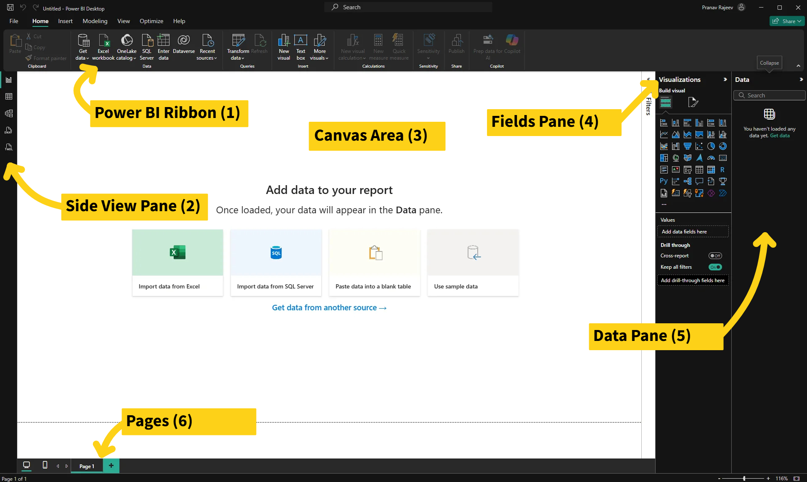

1. Ribbon (Top)  
2. Side View Pane (Left) 
3. Canvas Area (Center)   
4. Fields Pane (Right)  
5. Data Pane (Right)  
6. Pages (Bottom)
7. 
## **Section 4: Basic Visualization**

### **Importing Data**

**Step 1:** In the Ribbon (1), there is a button called Get data. From here, you can find all the data sources you might need including. For our dataset, click on Text/CSV. 
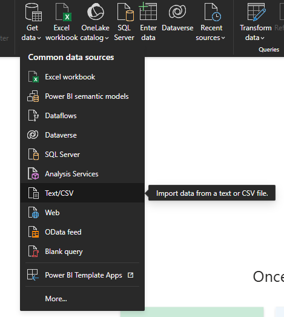
**Step 2:** Locate the desired file (cleaned_dataset.csv). Load the dataset. 
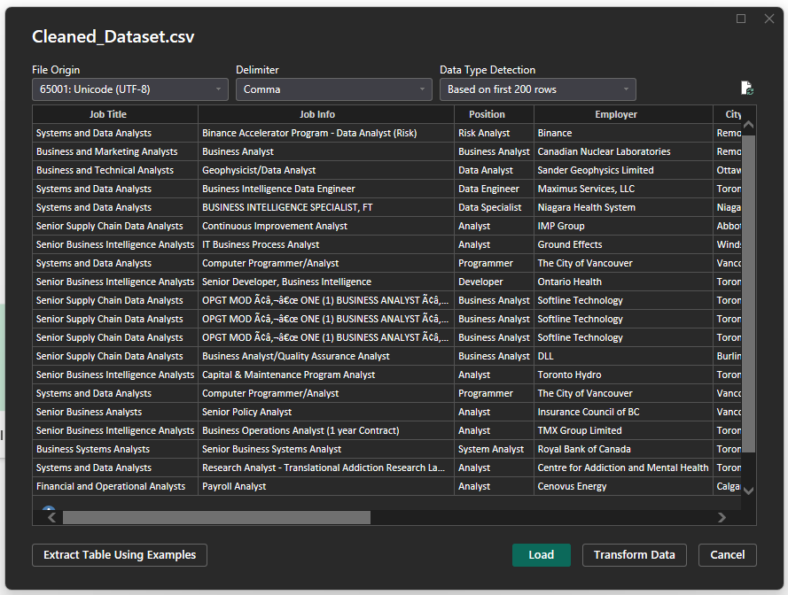 
**Step 3:** You will now see the dataset in the data panel. If you expand the dataset name, you’ll see the different column names in it.   
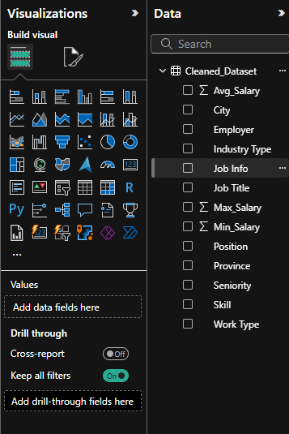

### **Transforming** 

In the Ribbon (1), there is a button called transform data. This will take you to the Power Query Editor where you can do things like: 

- Remove unnecessary columns  
- Rename columns  
- Change data types (e.g., text, number, date)  
- Filter rows (e.g., remove nulls)

Click **Close & Apply** to save changes.

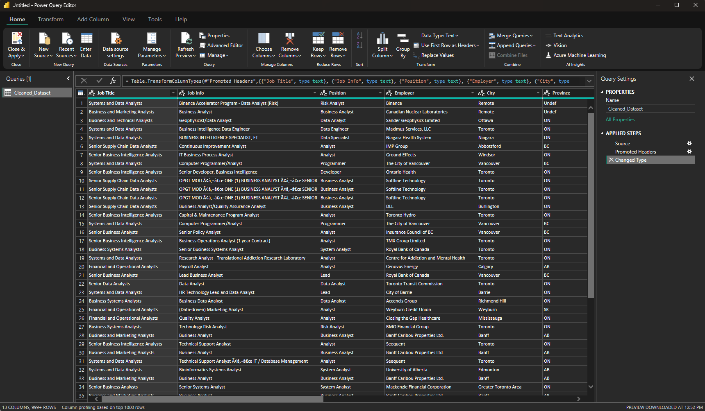

### **Creating Dax measures/columns**

**DAX (Data Analysis Expressions)** is the formula language in Power BI. You can use it to create calculated fields that aren’t in your dataset.

#### Calculated Columns  

These are added to your data table  

For example, we can make an in-person indicator column. If the job requires you to be in-person at any point, “Yes” and if not, “No.”

To do this, you can either right-click on your dataset and choose ‘new column’ or go to Modeling → New Column. 

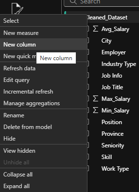
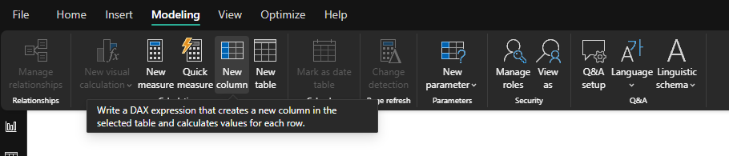 

Then, in the textbox that opens up, replace ‘column’ with the name you want your column to be and enter the code. For this example, it would be: 

```dax
notremote = IF(OR(Cleaned_Dataset[Work Type] = "Hybrid", Cleaned_Dataset[Work Type] = "In-person"), "Yes", "No").  
```

Click the check-mark and you should now have a new label under your dataset in the right data panel.   
 
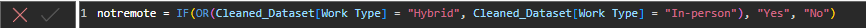

#### DAX Measures 

Similarly, you can also create DAX measures. These are values that are fields for your dataset. These are not stored in the table, they calculate values on the fly.

For example, say you want to see the jobs that pay above $100k. 

To do this, you can either right-click on your dataset and choose ‘new measure’ or go to Modeling → New Measure. 

Then, in the textbox that opens up, replace ‘Measure’ with the name you want your measure to be and enter the code. For this example, it would be: 

```dax
HighPayingJobs = CALCULATE(
    COUNTROWS(Cleaned_Dataset),
    Cleaned_Dataset[Avg_Salary] > 100000
)
```

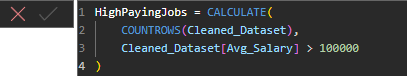

#### Card Visual

To see this value, we can create a visual. Let’s make a card. Cards are tools for presenting key metrics in a visually appealing format. 

**Step 1:** In the visualization panel, select the card icon  
**Step 2:** In the values field, drag and drop the HighPayingJobs measure

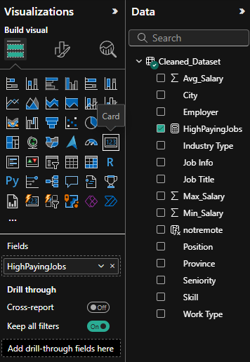  
Now on your canvas, you will be able to see the card. You can format this card in a number of ways in the ‘Format your visual’ tab in the visualizations panel (). 

### **Creating simple visuals**

Creating visuals in Power BI is pretty straightforward. 

1. You start by selecting the visual form the visualisation panel (e.g. stacked bar chart, line chart, etc.)   
2. Next, fill out the required fields.   
   1. Drag fields from your dataset (in Data Panel) and drag them into the fields sections (eg. x-axis, y-axis, tooltips, etc.)  
   2. Different visuals require different fields:  
      1. bar/column charts → need an axis  
      2. Card visuals → need only single numeric field  
3. Tooltips  
   1. Many visuals include a Tooltips section  
   2. Fields placed here will appear when you hover your mouse over parts of the visual, giving extra context without cluttering the main chart.

Let’s make a few visuals for this dashboard. 

Bar Chart:

Select Clustered Column Chart from the list of visuals. Then, in the axis, let’s drag in the province and for the y-axis, avg\_salary. For this, make sure to have the y-axis be average of avg\_salary. For tooltips, we can have our newly created measure of HighPayingJobs. You should see a chart like this: 

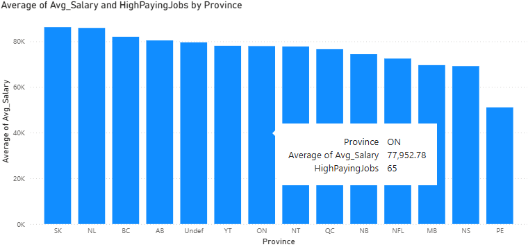  
When you hover over a bar, you can see the tooltip we added as well as other relevant information. This can be customized further to your liking like adjusting the titles/axis titles,changing the colour of the bars and more. Let’s try changing the bar colours:   
Head to the format your visual tab and select columns. Now, if you want each bar to be a separate colour, choose the different values in categories and select different colours. Another way to colour the bars is to have categories set to all and clicking the conditional formatting option (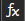). There are various options here. For example, we can set format style to gradient and this can be based on the average salary. Now, selecting ‘OK’, we can see that the bars are coloured such that higher average salary provinces are darker.    
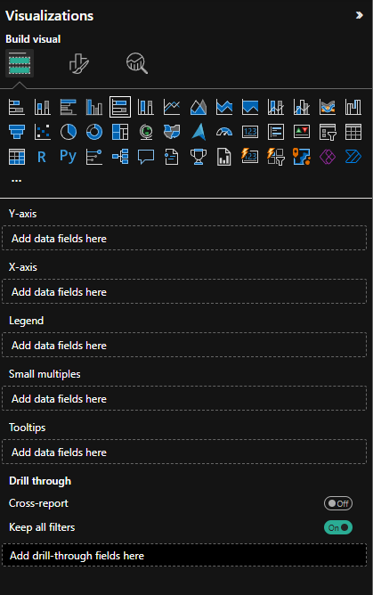 
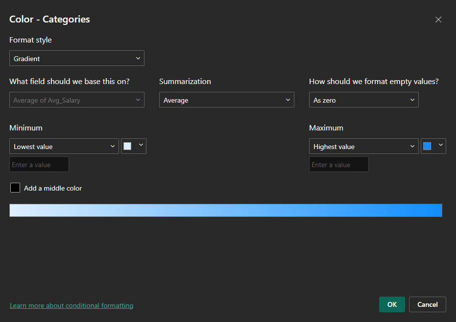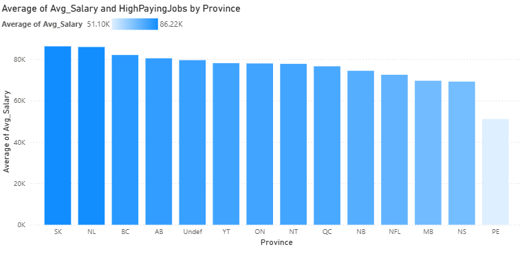

Let’s make one more. How about a pie chart this time. We can see the proportion of different work types in this list of jobs. 

Select Pie Chart from the list of visuals. For the legend, we want it to be coloured so that the different work types are shown. So, drag and drop ‘Work Type’ for Legend. For the values, we want all the different jobs available. So, we can drag and drop Job Title and set it to ‘count’. This counts the number of job titles that are there in the dataset.   
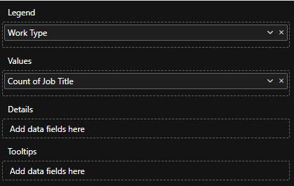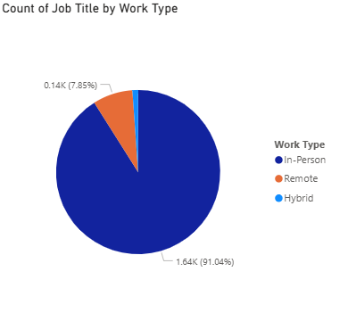

### **Slicers**

Slicers are interactive filters that allow users to quickly and easily filter data on a report page. These can be really helpful when analyzing a dataset. For our dashboard, let’s add a slicer. 

Start by selecting ‘Slicer’ from the list of visuals ().  
Next, add the field you want to filter by. We can do Industry Type. Now, we can see a new visual on our canvas. 

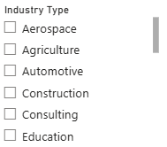  
Now, by selecting one of these industry types, the other visuals on our dashboard will get filtered to only that industry type. Try it out\! 

We can also customize the slicer. In the ‘Format your Visual’ tab, we can go to slicer settings to check out the available style options for this slicer. Slicers that measure different datatypes have different style options. For our slicer, we can set this to Dropdown if we want to save some room or keep it in a vertical list. Since there are so many industry types, Tile won’t work too well for us unless we have a lot of space available. We can also enable single/multi select in Slicer settings → Selection.   
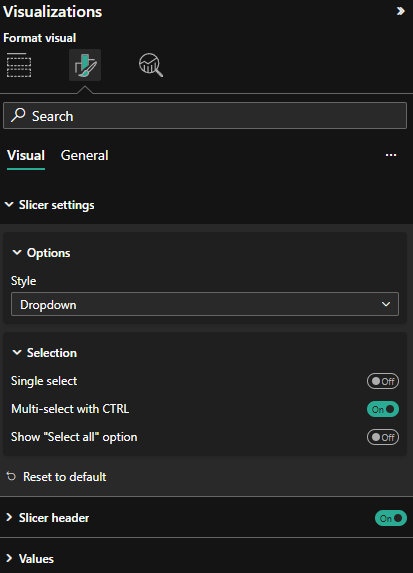  
Congratulations\! You’ve now made three different visuals to analyze this dataset (card, bar chart and pie chart). You can format your canvas the way you would like and for an exercise, try to come up with 4 more visualizations for your dashboard. Try out a new visual type and add a title to your dashboard canvas (From the Ribbon (1), Insert → Text Box). Add some customization as well like a colour theme. By unclicking on any selected visuals, we can also customize the page in the ‘Format your report page’ tab ().

## **Section 5: Saving and Publishing Dashboard**

Once your report is ready, you’ll want to save it locally and optionally share it online for others to view.

#### Saving your report locally

* Click on the save icon () on the top left of the screen or you can click file → save/save as. 

#### Publishing to Power BI Service  
Publishing lets you share your report online so others can interact with it.

* Sign in to Power BI Desktop (top-right corner) if you’re not signed in.  
* Click Publish on the Home ribbon.  
* Choose My Workspace (personal) or a shared workspace.  
* Once published, open Power BI Service to view your dashboard.

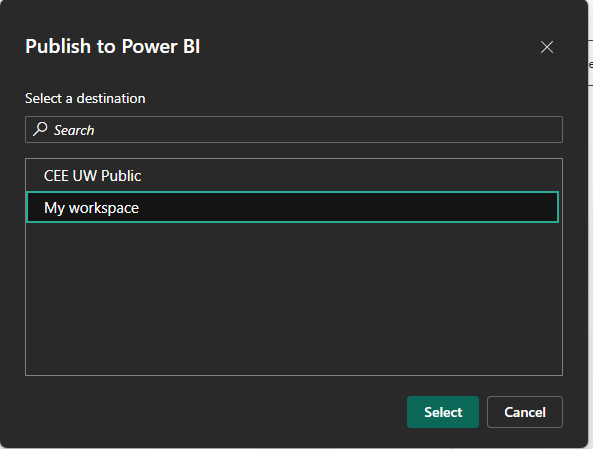

#### Exporting/Sharing

Once you’re on Power BI Service and see your dashboard, there are a number of options in terms of exporting/sharing. 
- One thing you can do is share your entire .pbix file. 
- You can also export as a pdf (export → PDF). 
- You can also export it to a PowerPoint (export → PowerPoint). 
- Lastly, depending on your email’s tenant, you may be able to create a shareable link for your dashboard by going to File → Embed Report → Publish To Web (Public). This is the best method of sharing, however, make sure that there isn’t any confidential information on your dashboard when you use this method as anyone with the link can access the dashboard. 

Some of the other features on Power BI service requires a premium subscription. 

## **Section 6: Final Documentation**

Create a folder and name it: [YourName]_Data_Analysis_PowerBI. In this folder, upload your .pbix Power BI file or create a document with the link to your published dashboard  
Open a new Google Doc and briefly explain the key finding(s) for each visual on your dashboard(s). Wrap it up with a short conclusion that brings your insights together  
One you’re done, share your folder with [Vicky Huang](mailto:vicky.h@glocalfoundation.ca). 