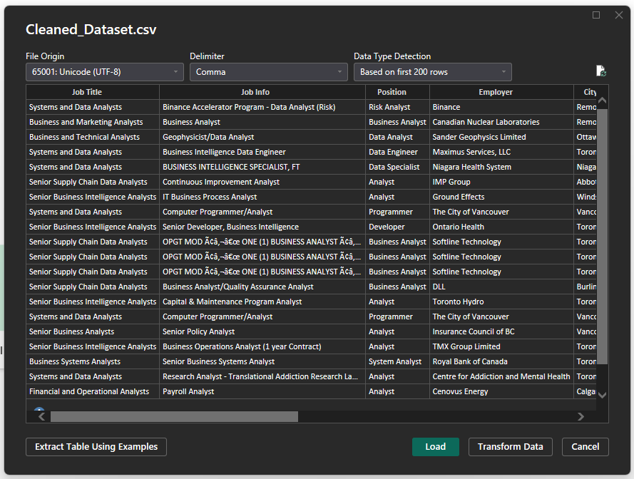
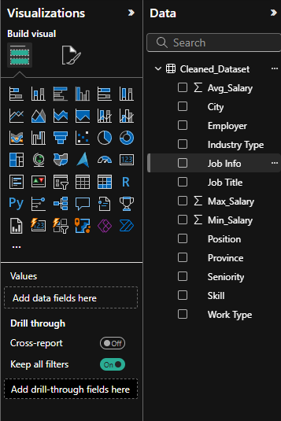

### **Importing Data**

**Step 1:** In the Ribbon (1), there is a button called Get data. From here, you can find all the data sources you might need including. For our dataset, click on Text/CSV. 

**Step 2:** Locate the desired file (cleaned_dataset.csv). Load the dataset.

 

**Step 3:** You will now see the dataset in the data panel. If you expand the dataset name, you’ll see the different column names in it.   

