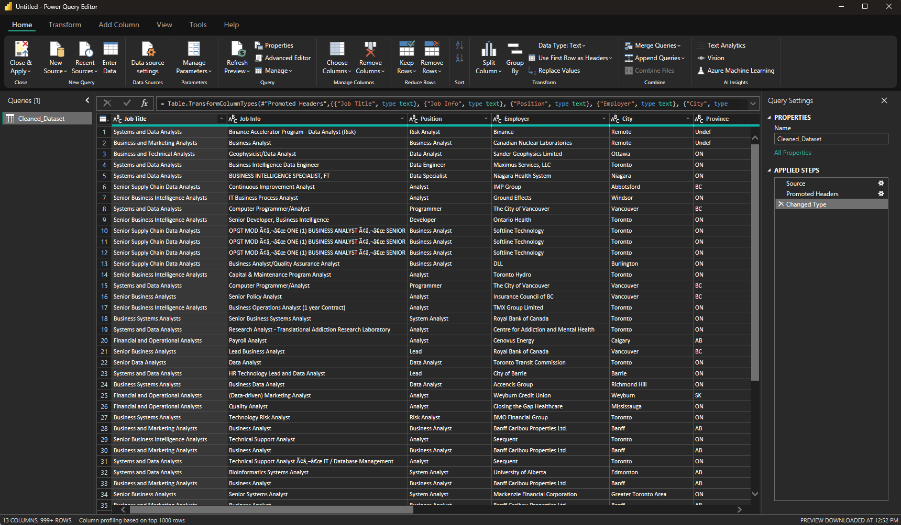

### **Transforming** 

In the Ribbon (1), there is a button called transform data. This will take you to the Power Query Editor where you can do things like: 

- Remove unnecessary columns  
- Rename columns  
- Change data types (e.g., text, number, date)  
- Filter rows (e.g., remove nulls)

Click **Close & Apply** to save changes.

