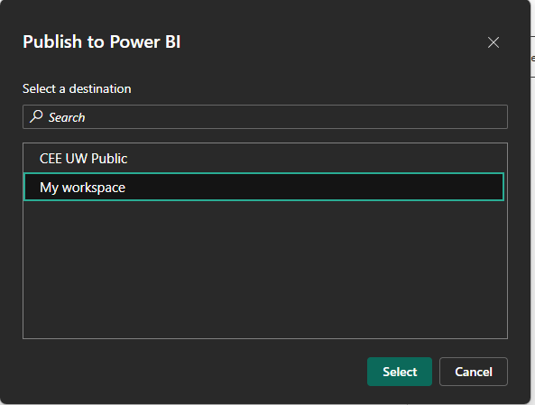

## **Section 5: Saving and Publishing Dashboard**

Once your report is ready, you’ll want to save it locally and optionally share it online for others to view.

#### Saving your report locally

* Click on the save icon () on the top left of the screen or you can click file → save/save as. 

#### Publishing to Power BI Service  
Publishing lets you share your report online so others can interact with it.

* Sign in to Power BI Desktop (top-right corner) if you’re not signed in.  
* Click Publish on the Home ribbon.  
* Choose My Workspace (personal) or a shared workspace.  
* Once published, open Power BI Service to view your dashboard.

#### Exporting/Sharing

Once you’re on Power BI Service and see your dashboard, there are a number of options in terms of exporting/sharing. 
- One thing you can do is share your entire .pbix file. 
- You can also export as a pdf (export → PDF). 
- You can also export it to a PowerPoint (export → PowerPoint). 
- Lastly, depending on your email’s tenant, you may be able to create a shareable link for your dashboard by going to File → Embed Report → Publish To Web (Public). This is the best method of sharing, however, make sure that there isn’t any confidential information on your dashboard when you use this method as anyone with the link can access the dashboard. 

Some of the other features on Power BI service requires a premium subscription. 