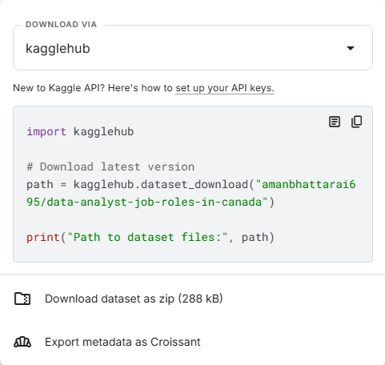

## **Section 4: Importing Sample Data And Table**

### Download Data From Kaggle

Let’s start by grabbing our dataset from **Kaggle**, an awesome free platform full of real-world data.

If you’re new to Kaggle, click **Register**. You can sign up with your Google account or email. If you already have an account, just sign in.

For this project, we’ll be using the dataset: [Data Analyst Job Roles in Canada](https://www.kaggle.com/datasets/amanbhattarai695/data-analyst-job-roles-in-canada)

To download:

* Click the **Download** button  
* Leave all settings as default as shown below:



* Then click **Download dataset as ZIP**

To import the sample dataset, follow these steps:

**Step 1:** In the Schemas Panel, right-click on your schema (*your_database_name*)

**Step 2:** Select Table Data Import Wizard.

**Step 3:** Browse for your dataset file (*Cleaned_Dataset.csv for ours*) and click Next.

**Step 4:** Choose the target destination where the data will be imported. If you already created a table for it, choose ‘*Use Existing Table.*’ Otherwise, select ‘*Create New Table*’ and choose the database and create a table name. 

**Step 5:** Workbench will automatically suggest column names and data types based on the CSV. Adjust if needed (e.g., change numbers to INT or DECIMAL, dates to DATE).

**Step 6:** Click Next → Finish.

```{admonition} Exercise \#9
On a new tab, use the clauses we’ve learned so far to analyze this dataset. Use 3 new clauses from the ‘Common Syntax’ tab to further analyze your dataset. Save this script to your folder. 
```