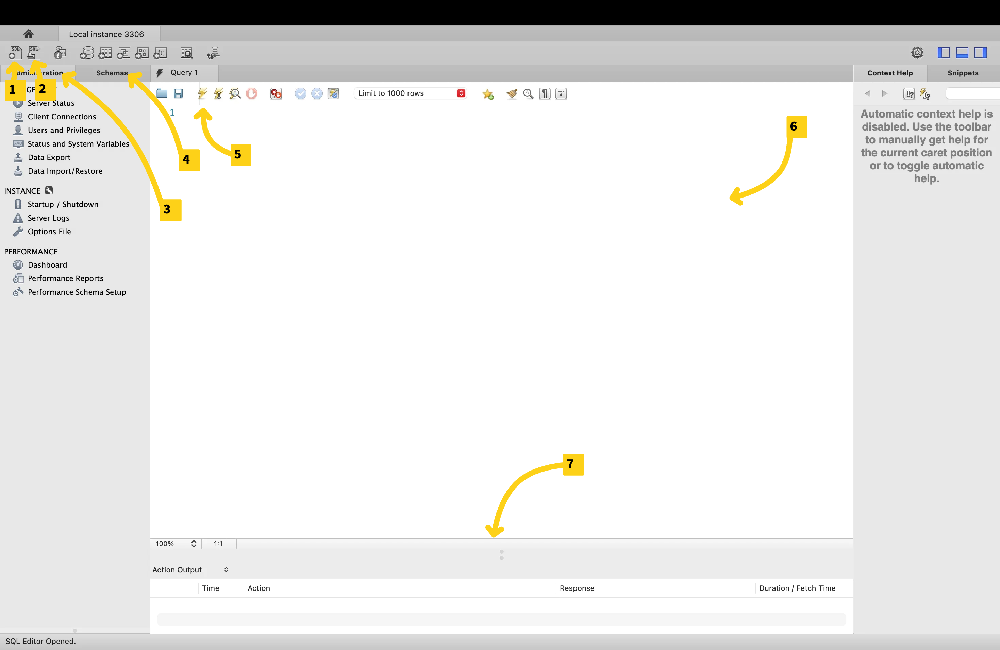
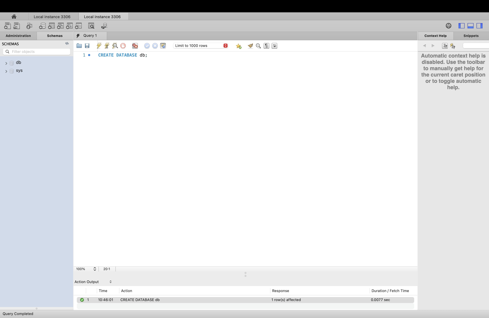
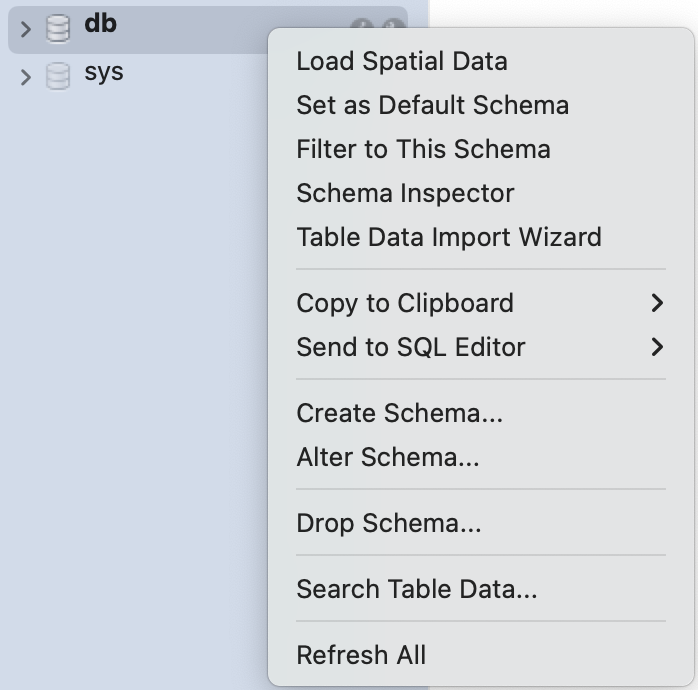

## **Section 3: Basic Data Analysis**

### Navigating MySQL Workbench

MySQL Workbench is MySQL’s official graphical interface for working with databases. It lets you do things like: 

* Connect to and manage MySQL servers  
* write/execute SQL queries  
* Explore data visually  
* export/import data easily

**Step 1:** Open MySQL Workbench  
**Step 2:** You should see ‘Local instance’ under MySQL Connections. If you **don’t**, follow these steps: 

* Click the plus beside *MySQL Connections*  
* Give the connection a name like ‘Local Instance’  
* Click on *Store in Keychain …* or *Store in Vault …* to enter the password made during installation  
* Test the connection and click *OK*

Every time you open MySQL Workbench, use this connection to connect to your local server. 


 
*\*This is MySQL Workbench on macOS. Windows will look slightly different but overall, they’re almost identical in terms of functionality\**

1. Create a new tab for writing SQL code (queries)  
2. Opening a SQL file  
3. Administration tab: used to do administrative work like starting/stopping a server, importing/exporting schemas and more  
4. Schemas tab: shows the databases that we have in the current database server. Right now, we just have sys (the database that MySQL uses internally to do its work) and maybe Sakila if you’re on Windows  
5. Run’s the query  
6. Query Editor Window: where we right SQL code  
7. Output panel/results grid \- where your query results/tables will appear

I will refer to some of these later on with a number in brackets (eg. (2))

### Saving Queries

To save your query, click on the save icon in the tool bar (near lightning bolt) \-\>   
Alternatively, you could click on file → save script as  
To create a new query tab, click on the new file icon (1) on the top left 

**Important Notes About Running Queries**

* End each SQL statement with a semicolon (\;). This tells SQL that the current statement is complete.  
* When you run a script, MySQL Workbench only executes the statement your cursor is currently inside (or the text you have highlighted).  
  * If your cursor is on the second line, only that statement will run, not the entire file.  
* To run all queries in the file, highlight them all first, then click the Execute button (⚡).  
* For this project, you can do all the learning queries in 1 tab if you’d like, however, do the exercises in separate tabs where stated. 
### Databases

You can think of a database as a folder. It acts as a container. Tables would be the files within the database (folder).   
**Creating a Database:**

* **Step 1:** In your query editor, write the query (replace \*\_\* with your db name)
```sql
CREATE DATABASE your_database_name;
```

- When you make MySQL queries, there is no case sensitivity so you don’t need to worry about capitalization of anything. A good format to follow, however, is using uppercase for keywords like CREATE DATABASE or SELECT (clause that you will learn soon)  
* **Step 2:** Click on the lightning bolt button (\#5 in the legend from earlier) to execute the statement  
  * You will see in your output (7) that the action was successful (green check)  
* **Step 3:** Select the Schemas tab (4) and hit the refresh button beside where it says schemas. You should now see your new database. 

 

**Use the database:** 

There are two ways: 

**Method 1:** Right click on the database and click on ‘Set as Default Schema’  
  
**Method 2:** In your query editor, write the query (replace \*\_\* with your db name)
```sql
USE your_database_name;
```
**Drop the database:**

* **Step 1:** In your query editor, write the query (replace \*\_\* with your db name)

```sql
DROP DATABASE your_database_name;
```

* **Step 2:** Click on the lightning bolt button (\#5 in the legend from earlier) to execute the statement  
  * You will see in your output (7) that the action was successful (green check)  
* **Step 3:** Select the Schemas tab (4) and hit the refresh button beside where it says schemas. You should not see your database now.

```{admonition} Exercise 1
Make a new tab. Create a database and use it. Save this script into a folder for the work you’ll do in this handbook.
```

## Tables

### Creating Tables

**Step 1:**  In your query editor, write the query (replace \*\_\* with your table and column names where required)

```sql
CREATE TABLE your_table_name (
      column_1_name column_type,
      column_2_name column_type,
      …
      column_i_name column_type,
);
```

Here’s an example:

```sql
CREATE TABLE personal_info (
        personal_id INT,
        first_name VARCHAR(50),
        last_name VARCHAR(50),
        age INT,
        gender VARCHAR(10),
        birth_date DATE
);
```


**Step 2:** Run the code and hit the refresh button in the schemas tab. You should see your table in your database now.

```{tip}
For a list of data types (Int, Varchar, etc.) go to the syntax tab
```


```{admonition} Exercise \#2
Make a new tab. Create a table for a list of employees. Include at least 5 columns with at least 3 different data types.  
```

### Inserting Rows Into Tables


In your query editor, write the query (replace with your table and column names where required)

```sql
INSERT INTO your_table_name
VALUES (column_1_entry, column_2_entry, …, column_i_entry);
```
Here’s an example for the table we created earlier:

``` sql
INSERT INTO personal_info 
VALUES (1, ‘Michael’, ‘Scott’, 40, ‘Male’, ‘1965-03-15’),
               (2, ‘Walter', 'White', 50, 'Male', '1958-09-07'),
               (3, 'Elizabeth', 'Keen', 30, 'Female', '1985-12-20');
```


To view your table, in your query editor, write the query

```sql
SELECT * FROM your_table_name
```

For the table from earlier:
``` sql
SELECT * FROM personal_info;
```


```{admonition} Exercise 3
In the tab from exercise 2. insert at least 5 rows to your table of employees. Use the SELECT statement to view your table.
```

### Writing and Running Basic Queries

#### Select Statement

To view your table, in your query editor, write the query

```sql
SELECT * FROM your_table_name
```

To view only specific columns, in your query editor, write the query

```sql
SELECT column_name_1, column_name_2, …, column_name_i FROM your_table_name
```

For the example earlier, we can show the table with only the columns name and age

``` sql
SELECT first_name, age FROM personal_info;
```

```{admonition} Exercise \#4
In the tab you used for exercise 2, try showing only three of the columns that are in your dataset.
```

#### Filtering (Where Statement)

To extract only the records that fulfill a specified condition, we use the WHERE statement with your SELECT statement 
```sql
SELECT * FROM your_table_name
WHERE condition
```

For the example earlier, we can show the table with only the columns name and age

```sql
SELECT first_name, last_name, age FROM personal_info
WHERE gender = ‘female’
```

```{tip}
There are lots of formats for writing conditions. You can use Basic comparison operators (=, \!= (or \<\>), \<, \>, \<=, \>=), multiple conditions with AND/OR: (WHERE gender \= 'Male' AND age \> 45;) and even do things like pattern matching with the LIKE operator. 

If you want to find more operators like this, check out the ‘Common Syntax’ tab for clauses like ‘In’, ‘Between’, ‘Like’ and ‘Regex’. 
```

```{admonition} Exercise \#5

In the same tab as exercise 2, create a filter using at least 1 AND/OR. 
```
#### Sorting Data (Order By Statement)

To sort the rows returned by your query, use the ORDER BY clause. You can sort results in ascending order (default) or descending order by adding DESC.

```sql
SELECT * FROM your_table_name
ORDER BY column_name (DESC if needed);
```

For the example earlier, we can order the table by age (ascending):

```sql 
SELECT first_name, last_name, age FROM personal_info
ORDER BY age;
```

Or we can order the table by age (descending):
```sql
SELECT first_name, last_name, age FROM personal_info
ORDER BY age DESC;
```

```{admonition} Exercise \#6

In the same tab as exercise 2, order your dataset by a column in descending order. 
```
#### Limiting Results (Limit Statement)

To return only a certain number of rows, use the LIMIT clause. This is helpful when working with large datasets.

```sql
SELECT * FROM your_table_name
LIMIT number_of_rows;
```

For the example earlier, we can limit to only 2 rows:

```sql 
SELECT * FROM personal_info
LIMIT 2;
```

```{admonition} Exercise \#7
In the same tab as exercise 2, use the select function while limiting results to only 3 rows. 
```

You can also stack all these clauses. 

```sql 
SELECT * FROM your_table_name
WHERE condition
ORDER BY column_name
LIMIT number_of_rows;
```

```{admonition} Exercise \#8

In the same tab as exercise 2, show your dataset while using all of the SELECT, WHERE, ORDER BY and LIMIT clauses. Now save this script with exercises 2-7 into your folder. 
```