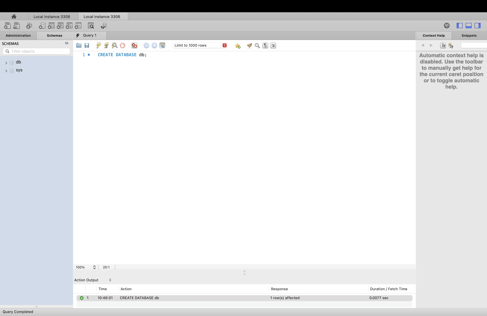
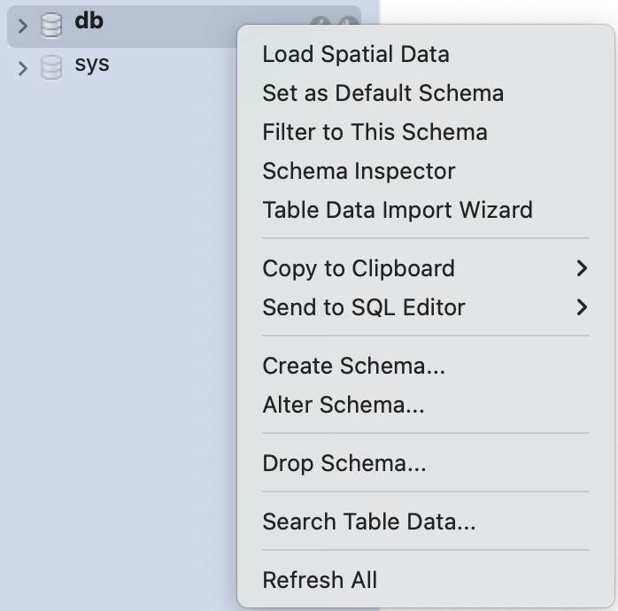

### Databases

You can think of a database as a folder. It acts as a container. Tables would be the files within the database (folder).   
**Creating a Database:**

* Step 1: In your query editor, write the query (replace \*\_\* with your db name)

| CREATE DATABASE \*your\_database\_name\*; |
| :---- |

- When you make MySQL queries, there is no case sensitivity so you don’t need to worry about capitalization of anything. A good format to follow, however, is using uppercase for keywords like CREATE DATABASE or SELECT (clause that you will learn soon)  
* Step 2: Click on the lightning bolt button (\#5 in the legend from earlier) to execute the statement  
  * You will see in your output (7) that the action was successful (green check)  
* Step 3: Select the Schemas tab (4) and hit the refresh button beside where it says schemas. You should now see your new database. 

 

**Use the database:** 

There are two ways: 

Method 1: Right click on the database and click on ‘Set as Default Schema’  
  
Method 2: In your query editor, write the query (replace \*\_\* with your db name)

| USE \*your\_database\_name\*; |
| :---- |

**Drop the database:**

* Step 1: In your query editor, write the query (replace \*\_\* with your db name)

| DROP DATABASE \*your\_database\_name\*; |
| :---- |

* Step 2: Click on the lightning bolt button (\#5 in the legend from earlier) to execute the statement  
  * You will see in your output (7) that the action was successful (green check)  
* Step 3: Select the Schemas tab (4) and hit the refresh button beside where it says schemas. You should not see your database now.

### Exercise \#1

Make a new tab. Create a database and use it. Save this script into a folder for the work you’ll do in this handbook. 
